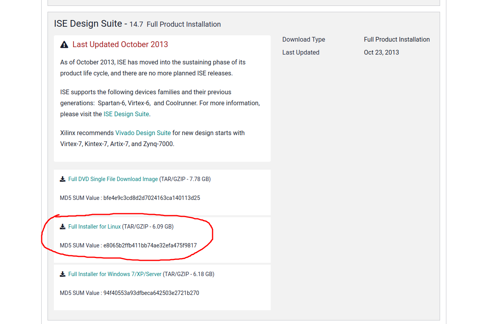
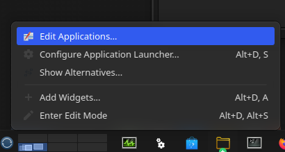
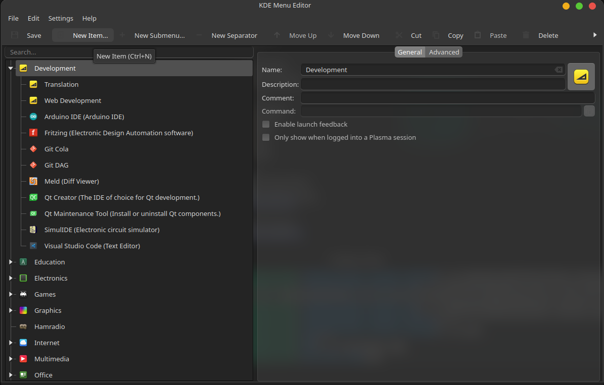
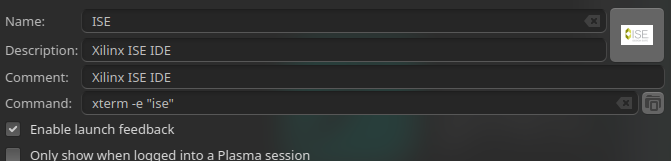

Xilinx-ISE
===============================================================================

Xilinx ISE Docker 
Current version: Xilinx ISE 14.7

Description
-------------------------------------------------------------------------------

Xilinx ISE 14.7 docker.

Content
-------------------------------------------------------------------------------

- ``resources``: folder containing third-part file, including the Xilin ISE installation file;
- ``image_addon``: folder containing materials used for the customization of the image during the building step;
- ``doc``: folder containing material for this documentation;
- ``launcher``: set of tools used to run and use the builded image: -
  - script used to run the image;
  - docker-compose file to run the container in a structured environment
  - application launcher to add to your distro
  - the ``xilinx_home_folders``  contains the folders used as volumes for /home/xilinx/.Xilinx and /home/xilinx/.config/Xilinx folders inside the docker image. This behavior allows storing the IDE's settings and use theme on each session.

> **_NOTE:_**  The ``xilinx_home_folders`` should be copied (or/and re-named it) everywhere you want. The right path inside the scripts used as launcher have to be replaced with the default ones. For how to do this, see the "Prepare for the usage" paragraph.


Requirements
-------------------------------------------------------------------------------

- Make sure you have at enough space available to create the docker image. The install files take 6GB, the final image has about 28GB.

- Obtain the Xilinx ISE installation file via the [Download page](https://www.xilinx.com/support/download/index.html/content/xilinx/en/downloadNav/vivado-design-tools/archive-ise.html) and select the [Full Installer for Linux](https://www.xilinx.com/member/forms/download/xef.html?filename=Xilinx_ISE_DS_Lin_14.7_1015_1.tar) (requires authentications).



- Create a free license via the [Licensing Solution Center](https://www.xilinx.com/getlicense)


Prepare for the building
-------------------------------------------------------------------------------

- Assuming that the installation file is named ``Xilinx_ISE_DS_Lin_14.7_1015_1.tar``, copy it into the ``resouces`` folder;


How to build the image
-------------------------------------------------------------------------------

Run docker build script:
```
./build.sh
```

Prepare for the usage
-------------------------------------------------------------------------------

- Copy Xilinx.lic licence file into ```launcher/xilinx_home_folders/Xilinx``` (or everywhere you have placed the folder ``xilinx_home_folders``)


How to run the IDE
-------------------------------------------------------------------------------

### Use script

open the file ``launcher/script/ise`` and set these variables in accordance with your environment:

``XILINX_HOME_FOLDERS``: full path of the folder ``xilinx_home_folders``
``WORKDIR``: folder to use to store your projects
``HOSTNAME``: hostname used during the creation of the licence file (default is ```$(hostname)```)

To open the ISE IDE run:

```
./launcher/script/ise
```

### Use docker-composer

> **TODO:**

Create an application launcher
-------------------------------------------------------------------------------

- Copy launcher/script/ise into /usr/bin (or into one of the path presents into PATH varible)
- Add an application launcher through one of the possible way. For example via the Menu Editor (follow the step by step procedure used under KDE)
    - Right click on "Application launcher" icon

    - Go in "Development" (or everywhere you want to add the new launcher) and
click on "New Item...

    - Give to the new item the name you prefer (e.g. "Xilinx ISE") and add the icon presents to the folder launcher/ise.png (or where you have placed it). As command type ```xterm -e "ise"```

    - Click on "Save". Done.

References
-------------------------------------------------------------------------------

- https://support.xilinx.com/s/question/0D52E00006iHsm5SAC/hostid-not-found-properly-by-license-manager-vivado-20154-nodelocked-license-ubuntu?language=en_US
- https://docs.docker.com/engine/reference/commandline/network_create/